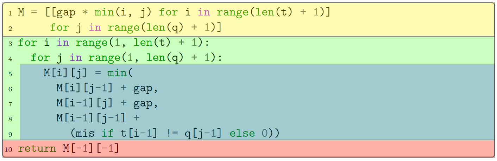

# 💠 Vectron

## Introduction
Vectron is a compiler pass that automatically analyzes and vectorizes array or matrix-based dynamic programming (DP) kernels to maximize throughput over a large set of instances.
Based on our experiments, it can improve the performance of DP algorithms up to 18 times.

Vectron is based on [Codon](https://github.com/exaloop/codon), an ahead-of-time Pythonic compilation framework.

## Installation

Before building and using Vectron, please ensure that you have the following prerequisites:

- Codon and its LLVM distribution (ideally built from source; see [here](https://docs.exaloop.io/codon/advanced/build) for details)
     - Codon GPU support (with LLVM NVPTX) is required for GPU support
- Clang++
- (optional) [Seq library](https://github.com/exaloop/seq) for experimental section

Then, build vectron as follows:
```cmake
cmake -S vectron -B vectron/build -G Ninja \
      -DCMAKE_CXX_COMPILER=clang++ -DCMAKE_C_COMPILER=clang \
      -DCODON_PATH=<path to Codon>
      -DLLVM_PATH=<path to Codon LLVM>
cmake --build vectron/build
cmake --install vectron/build
```

If stuck, please see our [Dockerfile](docker/vectron/Dockerfile) for the exact build script.

## Running

After building Vectron, use Vectron as follows:
```
codon build -plugin vectron -release example.codon
```

Vectron will vectorize a dynamic programming kernel annotated with `@vectron_kernel` (see below for details).
For example, here is implementation of edit distance calculation that can be vectorized by Vectron:

```python
import time, sys
from vectron.dispatcher import *

var_type = "i16"  # Use CPU SIMD

# Use vectron to annotate DP kernel
@vectron_kernel
def levenshtein(Q, T):
  M = [[0] * (len(Q) + 1) for _ in range(len(T) + 1)]
  for i in range(len(T) + 1):
    M[i][0] = -2 + i * -4
  for j in range(len(Q) + 1):
    M[0][j] = -2 + j * -4

  # Kernel
  for i in range(1, len(T)+1):
    for j in range(1, len(Q)+1):
      M[i][j] = max(
        M[i - 1][j] - 2,
        M[i][j - 1] - 2,
        M[i-1][j-1] + (2 if Q[j-1] == T[i-1] else -3)
      )

  # Aggregation
  return M[-1][-1]

# Use @vectron_scheduler for functions that call the kernel on list of pairs
@vectron_scheduler
def invoke(x, y):
    score = [[0 for i in range(len(y))] for j in range(len(x))]
    for i in range(len(x)):
        for j in range(len(y)):
            score[i][j] = levenshtein(x[i], y[j])
    return score

# x and y are lists of strings; 
# each sequence from x is aligned to a sequence from y at the same position
# (i.e., we align x[i] to y[i] for each i)
d = invoke(x, y)
```

Details:
- `var_type`: determines the type of auto-vectorization, where `i16` will invoke the CPU and `f32` will invoke the GPU mode.
- `@vectron_kernel`: is the decorator for the main kernel of vectron. It has three parts:
     - Initialization: initialization of 1 to 3 DP matrices through for loops or list comprehensions
     - Kernel: DP recurrence calculation. 
       The main available operations are: `min`, `max` (with 2 or 3 arguments); matrix element access, addition/subtraction with a constant, 
       a ternary `if-else` instruction, or a call to a function decorated with `@vectron_max` (for comparing two input elements).
     - Aggregation: compute the final result. 
       This part can return a matrix element (or a math operation on a matrix element), or a call to a function decorated with `@vectron_bypass`.
- `@vectron_scheduler`: handles and modifies how the input sequences are paired and sent to the main kernel. In this function---which basically loops over the target and then the query sequences---the user can determine which target sequences gets paired up with which query sequences by modifying the nested loops' start, step and stop values.


## Under the Hood

Vectron starts by analyzing all functions with decorators starting with the `@vectron` decorator that contain a single instance DP kernel (this kernel function is decorated with `@vectron_kernel`). For each such kernel, Vectron generates a new procedure that takes a list of instances as input and performs a set of specific operations in parallel on these instances.

Kernel analysis begins by dividing the kernel function into three major blocks.
1. The first block — **initialization block** — deals with the creation and initialization of a DP matrix. Vectron considers anything before the main set of `for` loops as a part of the initialization block.
2. The second block — **loop block** — is the core part of a DP method responsible for populating the DP matrix. It consists of a series of nested `for` loops and a DP recurrence. DP recurrence is considered as a **recurrence block**. Vectron assumes that everything within the innermost `for` loop is a recurrence block.
3. Finally, the **aggregation block** aggregates and returns the final result from the calculated matrix. Vectron treats anything after the iteration block as the aggregation block.

### Recurrence analysis

The main Vectron analysis pass consists of identifying and analyzing the iteration and recurrence blocks within a DP kernel. 
The pass begins by detecting a block of the nested for loops within the function. Once found, Vectron identifies the iteration behavior by extracting `start`, `step`, and `stop` bounds of each loop. 
Typically, `stop` is a constant or the length of an instance (e.g., string) plus or minus a constant, while the `start` and `step` values are constants.
However, Vectron supports more complex custom ranges within the innermost loop. One example of this is the banded Smith-Waterman algorithm that only populates `M` within a diagonal band of a certain, user-defined length. 

Once the loop range values have been identified, the pass moves on to the recurrence within the innermost `for` loop. There, it analyzes the recurrence expression and replaces it with the vectorized equivalent; in the case of SIMD, Vectron uses the `Vec` type and the associated SIMD intrinsics from Codon's SIMD library. 

A recurrence expression is any expression that minimizes or maximizes something via `min` or `max` operator. 
This expression is itself composed of various subexpressions that are typically arguments to the `min`/`max` operators.
Vectron vectorizes these subexpressions that are either (1) constants, (2) arithmetic operations on top of a previously calculated DP matrix value, (3) `max` operators + ‘store’ (assignment) operator (by calling a function decorated with `@vectron_max`), (4) comparator function (which can be a ternary operator or a call to a comparator function decorated with `@vectron_cmp`), or (5) an arithmetic combination of previous expressions. 

Upon analyzing the loop block, Vectron instantiates a separate loop block that iterates over a set of instances and auto-vectorizes the recurrence to perform each step in a data-parallel manner through either SIMD or SIMT (GPU) strategy. 


### Initialization and aggregation

Vectron treats any code before the main loops as the initialization block where the DP matrices are built. The user can build one to three different matrices in this block through conventional methods. Vectron will attempt to vectorize the initialization list comprehensions if possible; if not, it will build matrices as-is. Following the initialization, Vectron will identify the DP matrices and translate them to a semi-3D cache-friendly vectorized structure that will be used by the vectorized kernel. 

The aggregation block typically contains a return statement that can be easily vectorized. In some instances, this block can contain a more complex set of statements or call a special `aggregation` function (decorated with `@vectron_bypass`, which performs additional operations on top of the final matrix score (e.g., `z-drop` score processing implemented by many Smith-Waterman methods). Aggregation functions are also vectorized whenever possible.

The following photo demonstrates a sample of the kernel. This sample is the Needleman Wunsch Algorithm and its components. The initialization block (lines 1–2; yellow box) initializes the DP matrix M. The loop block (lines 3–9; green box) iterates through the subproblems. The recurrence block within it (lines 5–9; blue box) populates M via the DP recurrence, while the aggregation block (line 10; red box) returns the desired score.




### Scheduling

Finally, Vectron integrates previous steps into a scheduler function that processes sequence pairs and dispatches them to the vectorized kernel (decorated with `@vectron_scheduler`). Currently, Vectron's scheduler groups together pairs into blocks that are all to be executed in a data-parallel fashion. Typically, the scheduler groups `n` pairs into `n/v` blocks, where `v` is the maximum parallel throughput (e.g., `v` is 16 for 256-bit AVX2 vectors that contain packed 16-bit integer values). Each block will form a 3D structure that will be handled by the vectorized kernel.


## More examples

The following examples can be run as is with sample-generated data using `vectron_runner.codon` provided in the root folder of this repository. First build `vectron_runner.codon` in release mode:

```bash
codon build vectron_runner.codon -release
```

Then run the resulting executable with the path to any of the following scripts:

```bash
./vectron_runner /path/to/sample/script.codon
```

This will create a set of sample target and query sequences and run the sample script using them.

### Banded Hamming Distance

```python
import time
import sys
from vectron.dispatcher import *

var_type = "i16"

@vectron_kernel
def hamming(t, q):
    M = [[0 for i in range(len(q) + 1)] for j in range(len(t) + 1)]
    for i in range(1, len(q) + 1):
        for j in range(1, len(t) + 1):
            if j - i <= -1 or j - i >= 1:
                if j - i == -1 or j - i == 1:
                    M[i][j] = -10000
            else:
                M[i][j] = max(
                    M[i - 1][j - 1] + (0 if q[i - 1] == t[j - 1] else 1),
                    0, 0
                )
    print(M[-1][-1])
    return M[-1][-1]

@vectron_scheduler
def invoke(x, y):
    score = [[0 for _ in range(len(y))] for __ in range(len(x))]
    for i in range(len(x)):
        for j in range(len(y)):
            score[i][j] = hamming(x[i], y[j])
    return score

with open(sys.argv[-1], 'r') as file:
    seqs_x = [line.strip() for line in file]

with open(sys.argv[-2], 'r') as file:
    seqs_y = [line.strip() for line in file]

SEQ_NO_T = len(seqs_x)
SEQ_NO_Q = len(seqs_y)

with time.timing("Total: "):
    d = invoke(seqs_x, seqs_y)
```
This sample consists of an additional `if` block compared to the previous sample.

- The `if` block can have one or two operands.
     - The two operands can be connected via and `or` or an `and`
     - Each operand consists of loops' indices on the left side (with `-` or `+` signs) an arithmetic operator in between (`>`, `<`, `==`, `!=`, `>=`, `<=`) and a constant on the right side.
     - The above sample implements a banded implementation of the hamming distance algorithm that only fills in the diagonal of the resulting matrix.
 
### Manhattan Tourist

```python
import time
import sys
from vectron.dispatcher import *

var_type = "i16"

@vectron_cmp
def S(x, a, b, am, y):
    """
    Due to ambiguous elements ('N'), a specialized match function has been used
    instead of a ternary operator, hence the "@vectron.cmp" decorator.
    """
    if str(x) == "N" or str(y) == "N":
        return am
    elif x == y:
        return a
    else:
        return b

@vectron_kernel
def manhattan(t, q):
    M = [[0 for i in range(len(q) + 1)] for j in range(len(t) + 1)]
    for i in range(1, len(q) + 1):
        for j in range(1, len(t) + 1):
            M[i][j] = max(
                M[i][j - 1] + S(q[i - 1], 4, 1, 0, t[j - 1]),
                0,
                M[i - 1][j] + S(q[i - 1], 5, 3, 1, t[j - 1])
            )
    print(M[-1][-1])
    return M[-1][-1]

@vectron_scheduler
def invoke(x, y):
    score = [[0 for _ in range(len(y))] for __ in range(len(x))]
    for i in range(len(x)):
        for j in range(len(y)):
            score[i][j] = manhattan(x[i], y[j])
    return score

with open(sys.argv[-1], 'r') as file:
    seqs_x = [line.strip() for line in file]

with open(sys.argv[-2], 'r') as file:
    seqs_y = [line.strip() for line in file]

SEQ_NO_T = len(seqs_x)
SEQ_NO_Q = len(seqs_y)

with time.timing("Total: "):
    d = invoke(seqs_x, seqs_y)
```

This sample implements the Manhattan Tourist DP algorithm and has the `@vectron_cmp` decorated function in addition to the previous samples.

- The `@vectron_cmp` function has the following signature: ```python S(x, a, b, am, y)``` where `x` and `y` are two sequence elements, `a` is the matching reward, `b` is the mismatching penalty, and `am` is the ambiguous score (in case either `x` or `y` are equal to `N`).

### Banded Gotoh Smith-Waterman with Bypass

```python
import time
import sys
from vectron.dispatcher import *

var_type = "i16"

@vectron_bypass
def bypass(a, b, c):
    return 0

@vectron_cmp
def S(x, a, b, am, y):
    if str(x) == "N" or str(y) == "N":
        return am
    elif x == y:
        return a
    else:
        return b

@vectron_max
def max_s(lst, ind_row, ind_col, val_1, val_2):
    lst[ind_row][ind_col] = max(val_1, val_2)
    return lst[ind_row][ind_col]

def max_val(a):
    mx = 0
    for i in range(len(a)):
        for j in range(len(a[i])):
            if mx < a[i][j]:
                    mx = a[i][j]
    return mx  

@vectron_kernel
def gotoh(t, q):
    M = [[0 if (i == 0 and j == 0) else (-4 + i * (-2)) if (j == 0 and i > 0) else (-4 + j * (-2)) if (i == 0 and j > 0) else 0 for j in range(len(q) + 1)] for i in range(len(t) + 1)]
    E = [[-10000 if (i == 0 and j == 0) else (-4 + i * (-2)) if (j == 0 and i > 0) else -10000 for j in range(len(q) + 1)] for i in range(len(t) + 1)]
    F = [[-10000 if (i == 0 and j == 0) else (-4 + j * (-2)) if (i == 0 and j > 0) else -10000 for j in range(len(q) + 1)] for i in range(len(t) + 1)]
    for i in range(1, len(q) + 1):
        for j in range(1, len(t) + 1):
            if j - i <= -105 or j - i >= 105:
                    if j - i == -105 or j - i == 105:
                        M[i][j] = -10000
                        F[i][j] = -10000
                        E[i][j] = -10000
            else:
                M[i][j] = max(M[i - 1][j - 1] + S(t[i - 1], 2, -4, -3, q[j - 1]),
                            max_s(E, i, j, E[i - 1][j] - 2, M[i - 1][j] - 6),
                            max_s(F, i, j, F[i][j - 1] - 2, M[i][j - 1] - 6))
    print(bypass(M[-1][-1], max_val(M), 800))
    return bypass(M[-1][-1], max_val(M), 800)

@vectron_scheduler
def invoke(x, y):
    score = [[0 for _ in range(len(y))] for __ in range(len(x))]
    for i in range(len(x)):
        for j in range(len(y)):
            score[i][j] = gotoh(x[i], y[j])
    return score

with open(sys.argv[-1], 'r') as file:
    seqs_x = [line.strip() for line in file]

with open(sys.argv[-2], 'r') as file:
    seqs_y = [line.strip() for line in file]

SEQ_NO_T = len(seqs_x)
SEQ_NO_Q = len(seqs_y)

with time.timing("Total: "):
    d = invoke(seqs_x, seqs_y)
```

The banded Smith-Waterman with Gotoh scoring is the most sophisticated implementation in Vectron. It consists of 3 matrices, the use of `@vectron_max` and the use of `@vectron_bypass`.

- The `@vectron_max`function signature is as follows: ```python max_s(lst, ind_row, ind_col, val_1, val_2)``` where it receives a destination matrix pointer (`lst`), an index for its row value (`ind_row`), and index for its column value `ind_col`, and two values for comparison (`val_1` and `val_2`). These two values can be constants or matrix elements `+` or `-` a constant. The function compares the two values and stores the maximum in the pointer's specified location. It also returns this maximum value to the kernel.
- The `@vectron_bypass` function is used mostly in genomics. Its main job is to filter out values that are more than a user-specified distance away from the maximum value in the scoring matrix. With the help of the `max_val` function that returns the maximum value of a given matrix, the `@vectron_bypass` function compares each score (`a` in the function signature) with the maximum value in the result matrix (`b` in the function signature) and determines if the distance between these two is greater than a user-specified value (`c` in the function signature). If `True` this function will return a large negative number, and if `False` the same score will be returned.

### Running the Samples with Input Sequences

After using the above build command for the any of the sample scripts, one can run the built script by passing the target and query sequences to it as ```sys.arg``` values. These sequences do not need to be paired up in advance, as `@vectron_schudler` will do that. Here's a sample command to run the built script with input sequences `seqx.txt` and `seqy.txt`:

```
./example ../data/seqx.txt ../data/seqy.txt
```

## Experiments
The [experiment directory](docker/experiments_docker) contains few popular DP implementations such as banded Smith-Waterman, Needleman-Wunsch, Hamming Distance, Levenshtein Distance, Manhattan Tourist, Minimum Cost Path, and Longest Common Subsequence (in both integer and floating point versions). Alignment scores are calculated using sample string files `seqx.txt` and `seqy.txt`, each containing 64 DNA sequences of length 512. All DP algorithms perform an all-to-all pairing and comparison between them.

## Limitations

The current version has some limitations that will be addressed soon.
Most importantly:

- The number of arguments in the min/max function is limited to three
- List comprehensions in the initialization cannot have newlines
- Vectron must be imported as `from vectron.dispatcher import *` (aliases won't work)

## License

[Apache 2.0](https://www.apache.org/licenses/LICENSE-2.0).

## Contact

[Sourena Moghaddesi](https://github.com/SourenM) ([souren at uvic dot ca](mailto:)) or [Ibrahim Numanagić](https://github.com/inumanag) ([inumanag at uvic dot ca](mailto:)).
